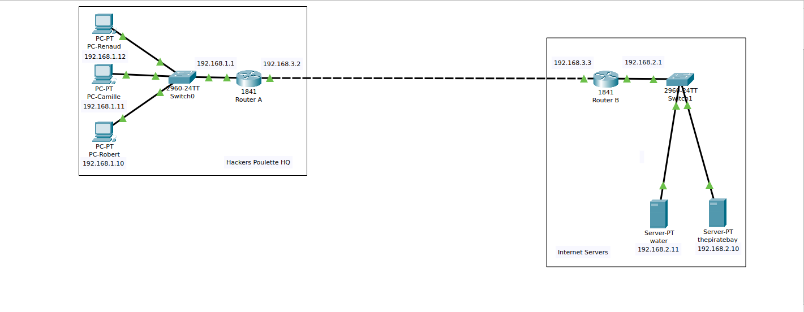

# Small Network Project



## What
This project involves the creation of a simple network infrastructure for Hackers Poulette, a new startup. The network aims to facilitate connectivity between three hosts and enable internet access.

## Why
The purpose of this project is to establish a scalable network infrastructure that can accommodate the growth of the startup. With ambitions for expansion, it's crucial to lay down a foundation that can easily adapt to the increasing demands of the organization.

## When
This project was initiated to meet the immediate networking needs of Hackers Poulette. As the startup is in its early stages, it's essential to establish a functional network infrastructure from the outset to support current operations and future growth seamlessly.

## How
To construct the network infrastructure for Hackers Poulette, the following hardware components were utilized:

- Switch: Cisco 2960 with Cisco IOS version 15.0(2) image lanbasek9 or a similar variant. The switch forms the backbone of the network, facilitating communication between devices.

- PCs: Three PCs running Windows 10 operating systems serve as the workstations for the startup employees. These PCs are essential endpoints in the network, enabling users to access resources and services.

- Router: A Cisco 1841 router was employed to establish connectivity between the internal network and the internet. The router serves as the gateway for internet access and performs routing functions to direct traffic between networks.

- Web & DNS Servers: These servers were incorporated into the network to provide essential services. The web server hosts the startup's website, while the DNS server resolves domain names to IP addresses, enabling users to access websites using human-readable addresses.

Additionally, eight Ethernet cables were utilized, including one crossover cable, to establish physical connections between devices and ensure proper data transmission within the network.

By configuring and interconnecting these hardware components using Cisco Packet Tracer, the network topology was created to meet the requirements outlined by Hackers Poulette.

## Who
This project is executed by Esaü, in collaboration with Hackers Poulette. The CEO, Robert Tappan Morris, has emphasized the importance of scalability and functionality in the network design to support the startup's aspirations.

### Logical Topology
```
PC-Robert: 192.168.1.10/24
PC-Camille: 192.168.1.11/24
PC-Renaud: 192.168.1.12/24 
```

### Testing Connectivity & Internet Access: 


## Pending Tasks
- Finalize documentation and ensure clarity in the network setup.
- Test the network configuration thoroughly to validate connectivity and internet access.
- Review security measures and implement necessary protocols to safeguard the network.
- Conduct scalability tests to ensure the network can accommodate future growth effectively.
- Document troubleshooting steps and solutions for potential issues that may arise in the future.
